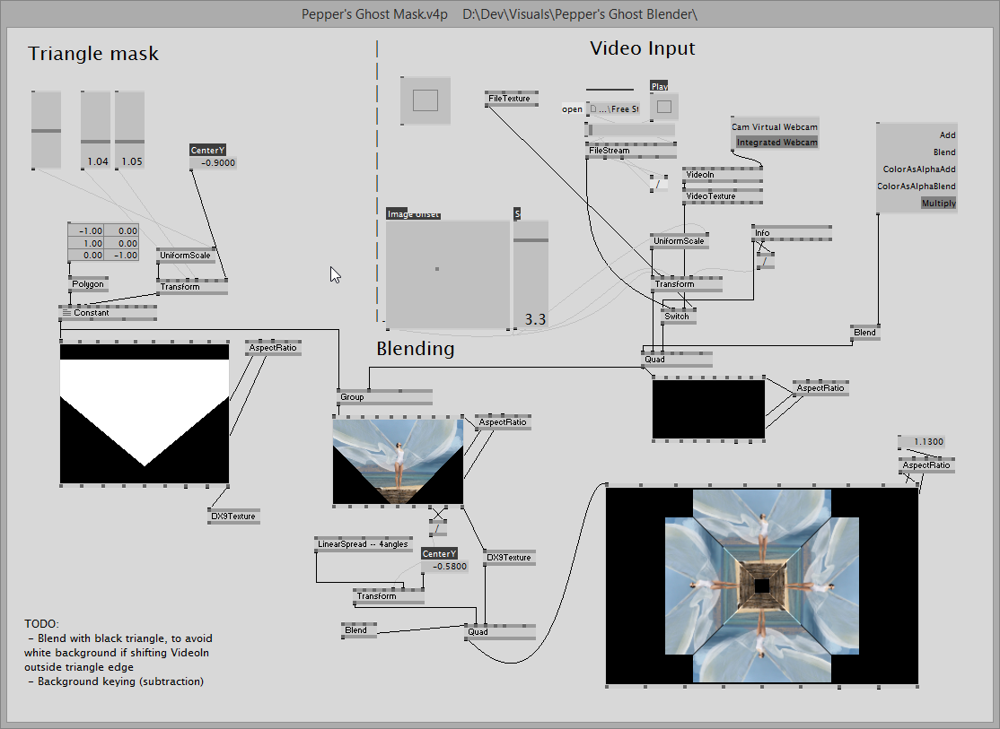

# Pepper's Ghost Blender

[VVVV](vvvv.org) patch to modify video in real-time for creating [Pepper's ghost](https://en.wikipedia.org/wiki/Pepper%27s_ghost) illusion with a reflective prism and a digital screen.

Currently it process either a video stream from available cameras or a video file. Does not remove background yet. 

[VLC](http://www.videolan.org/) is used in patch for playback. Additionaly, [ExifTool](http://owl.phy.queensu.ca/~phil/exiftool/) is used for extracting video metadata (not requried).

### How to use

Plenty of instructions on how to make such reflective prysm (pyramids) are available on the web with keywords "[homemade 3d hologram](https://www.google.com.ua/?gfe_rd=cr&ei=jj9SVqT6BOz37gTDsoG4Bg&gws_rd=ssl#q=homemade+3d+hologram))". However, naming is misleading since it has nothing to do with actual [holography](https://en.wikipedia.org/wiki/Holography). Its just an optical illusion of seeing [virtual image](http://neon-society-electronics.com/wp-content/uploads/2013/04/virtual_reflection.jpg).

vvvv allows video output to secondary display directly, or you can use any [FFGL](http://freeframe.sourceforge.net/)-enabled VJ/multi-screen software to display the video (e.g., [Arena](https://resolume.com/)). Concerning display, you can place desktop display horizontally and connect to PC via cable. Or you can stream generated video to your mobile device directly by creating a secondary virtual display on your PC and connecting to it via mobile using VNC client. 

I'm using [TightVNC server](http://www.tightvnc.com/licensing-tvnserver.php) for creating and sharing virtual display. Any mobile VNC client can connect to your virtual display then.

