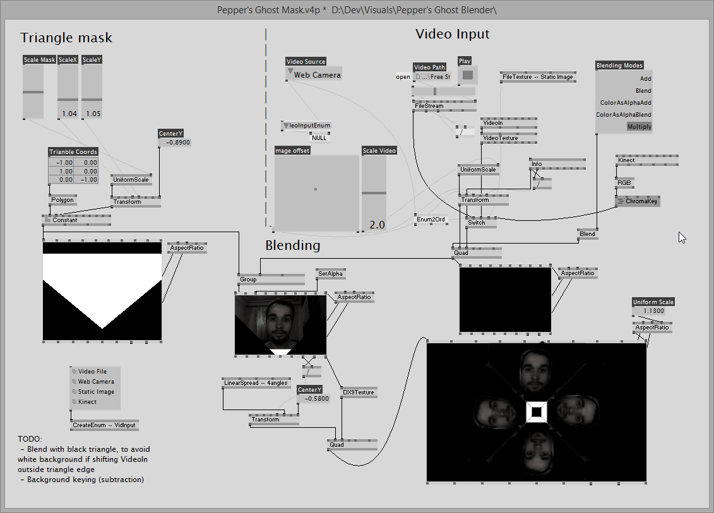
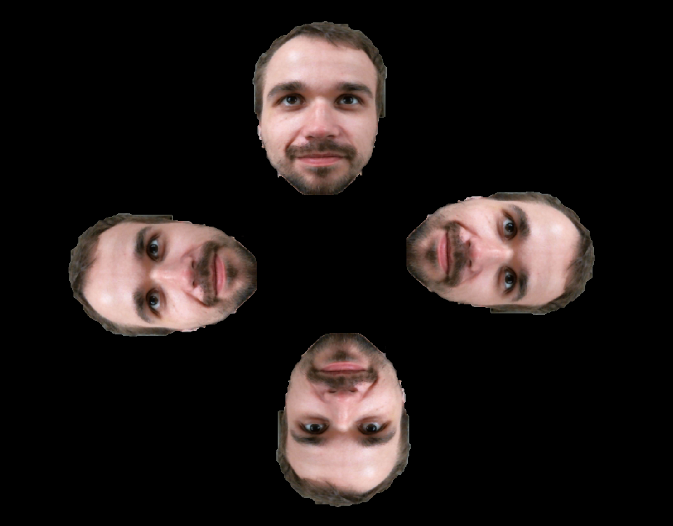

# Pepper's Ghost Blender

[VVVV](https://vvvv.org/) prototype for original head segmentation solution. 

Processes video in real-time. Intended to be used with reflective prism to create [Pepper's ghost](https://en.wikipedia.org/wiki/Pepper%27s_ghost) illusion with a digital screen.

[VLC](http://www.videolan.org/) is required for playback inside patch. Additionaly, [ExifTool](http://owl.phy.queensu.ca/~phil/exiftool/) is used for extracting video metadata (not requried).

### How to use

Plenty of instructions on how to make such reflective prysm (pyramids) are available on the web via keywords "[handmade 3d hologram](https://www.google.com.ua/?gfe_rd=cr&ei=jj9SVqT6BOz37gTDsoG4Bg&gws_rd=ssl#q=homemade+3d+hologram))". However, naming is misleading since it has nothing to do with actual [holography](https://en.wikipedia.org/wiki/Holography). Its just an optical illusion of seeing [virtual image](http://neon-society-electronics.com/wp-content/uploads/2013/04/virtual_reflection.jpg).

You need to organize a display for such pyramid and place it horizontally. It could be your laptop screen or better a secondary display/TV/ whatever you can connect to your laptop. vvvv allows fullscreen video output to a secondary display directly. Or you can use any [FFGL](http://freeframe.sourceforge.net/)-enabled VJ/multi-screen software to display this video stream (e.g., [Arena](https://resolume.com/)). 

As a workaround, if no extra display or projector is around, you can stream generated video to your mobile device by connecting to your laptop from mobile using VNC client. You can create virtual secondary screen for this (at least in Windows) which is more handy. I'm using [TightVNC server](http://www.tightvnc.com/licensing-tvnserver.php) for creating and sharing virtual display. Any mobile VNC client can connect to this virtual display then.

